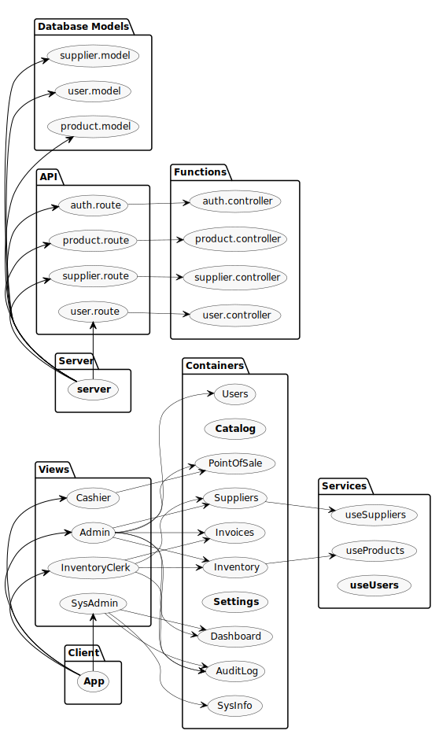

<div align="center">

# MC.fmly Inventory System


[](https://sonarcloud.io/dashboard?id=jhdcruz_MC.fmly-System)

**Status:**

[](https://app.circleci.com/pipelines/github/jhdcruz/MC.fmly-System)  [](https://travis-ci.com/jhdcruz/MC.fmly-System)

**Source Code:**

[](https://sonarcloud.io/dashboard?id=jhdcruz_MC.fmly-System) [](https://sonarcloud.io/dashboard?id=jhdcruz_MC.fmly-System) [](https://sonarcloud.io/dashboard?id=jhdcruz_MC.fmly-System)

**Project:**

[](https://wakatime.com/badge/github/jhdcruz/MC.fmly-System) [](https://sonarcloud.io/dashboard?id=jhdcruz_MC.fmly-System)

### Inventory System specifically built for MC.fmly.

</div>

---

## Table of Contents:

#### Specification

- [Architecture](#architecture)
- [Front-End](#front-end)
- [Back-End](#back-end)
- [Database](#database)
- [APIs](#apis)
- [Tools](#tools)

#### Development

- [Prerequisites](#prerequisites)
- [Installing Dependencies](#install-dependencies)
- [Development](#development)
  - [Web App](#web-app)
  - [Desktop](#desktop)
- [Production](#production)
  - [Web App](#web-app-1)
  - [Desktop](#desktop-1)
- [Testing](#testing) _(Planned)_

#### Misc

- [License](#license)

## Architecture

[](https://www.mongodb.com/mern-stack)

<p align="center"><a href="https://www.mongodb.com/mern-stack">MERN Stack Architecture</a></p>

### Front-End:

- [**React**](https://reactjs.org/) - _Component-based UI_
- [**Electron**](https://electronjs.org) - _X-Platform Desktop Integration_
- [**Sass/Scss**](https://sass-lang.com) - _CSS Preprocessor_
- [**MongoDB Charts**](https://mongodb.com/products/charts) - _Embeddable Charts & Data Analytics_
- [**`react-bootstrap`**](https://react-bootstrap.github.io/) - _UI Toolkit for `React`_
- [**`styled-components`**](https://styled-components.com/) - _ES6+ Component Styling_

### Back-End:

- [**Express**](https://expressjs.com) - _Server-side Framework_
- [**Node.js**](https://nodejs.org) - _Web Server_
- [**Axios**](https://github.com/axios/axios) - _HTTP Client_
- [**Mongoose**](https://mongoosejs.com) - _Object Modeling_
- [**`node-argon2`**](https://github.com/ranisalt/node-argon2) - _Node.js bindings for `Argon2` hashing algorithm_
  - [`Argon2`](https://github.com/P-H-C/phc-winner-argon2) - A password-hashing function that summarizes the **state of
    the art in the design** of memory-hard functions and can be used to hash passwords for credential storage, key
    derivation, or other applications.

### Database:

- [**MongoDB**](https://mongodb.com) - _Document database_

### APIs

- [**GitHub REST API**](https://docs.github.com/en/free-pro-team@latest/rest) - _System Commits & Releases_

### Tools

- [**Vercel**](https://vercel.com) - _Web Deployment (Front-End)_
- [**Heroku**](https://heroku.com) - _API Deployment (Back-End)_
- [**Datadog**](https://datadog.com) - _Server/Database Monitoring_
- [**LogDNA**](https://logdna.com) - _Log Management_
- [**Rollbar**](https://rollbar.com) - _Application Monitoring_
- [**CircleCI**](https://circleci.com/) - _Continuous Integration (Main)_
- [**GitHub Actions**](https://github.com/features/actions) - _Continuous Integration (Secondary)_
- [**TravisCI**](https://travis-ci.com/) - _Continuous Integration (Fallback)_
- [**CodeFactor**](https://codefactor.io) - _Code Review_
- [**CodeCov**](https://codecov.io/) - _Code Coverage_
- [**SonarCloud**](https://sonarcloud.io/) - _Code Quality & Security_
- [**Snyk**](https://snyk.io/) - _Dependency Security & Exploit POC_
- [**WhiteSource Renovate**](https://renovate.whitesourcesoftware.com/) - _Automated Dependency Updates_

> Boilerplate generated through ejected `create-react-app`.

---

## Prerequisites

- [`Node.js v14.15.0+`](https://nodejs.org/en/) - Package manager
- [`yarn v1.22+`](https://yarnpkg.com/getting-started/install) - Package & Project manager
- [`MongoDB Cluster`](https://mongodb.com/) - MongoDB Cluster URI

**Windows:**

- [**`python2.7`**](https://getpython.org) - For native dependency rebuilds
- [**`windows-build-tools`**](https://www.npmjs.com/package/windows-build-tools)

```shell
npm i -g windows-build-tools # Should be in elevated shell.
```

**Linux:**

- Debian
  - `dpkg`
  - `dpkg-dev`
  - `python2.7`

```shell
sudo apt install dpkg dpkg-dev python2.7
```

- Red Hat
  - `rpm`
  - `python2.7`

```shell
sudo yum install rpm python2.7
```

replace `yum` with your distro package provider.

**MacOS**

- `rpm`
- `python2.7`

> `brew install rpm python2.7`

**Optional:**

- [`Postman`](https://www.postman.com/) - API Testing
- [`MongoDB Compass`](https://www.mongodb.com/try/download/compass) - MongoDB GUI

## Environment Variables

- **`MONGO_URL`** - **Required** _(Production User)_
- `ROLLBAR_ID` - _Application Monitoring_

> Add your environment variables inside `/.env`.

```dotenv
MONGO_URL=[Your URI Here]
ROLLBAR_ID=[Your ID Here]
```

> Do not add quotation marks between values!

## Development

<div align="center">



</div>

This project uses yarn's [`workspaces`](https://classic.yarnpkg.com/en/docs/workspaces/) to seperate the **Front-End**
and the **Back-End** and run `scripts` without navigating back & forth to project folders.

> **Hoisting is set to `"*"`** to avoid compilation problems regarding missing dependencies.

**You have to install all dependencies before running any of the scripts.**

```shell
yarn
```

### Web App:

```shell
yarn web
```

### Desktop:

```shell
yarn start
```

## Production

### Web App:

You need to have a web provider that supports **`functions`**. Such as [**Vercel**](https://vercel.com), it can also be
other provider such as DigitalOcean, AWS, etc...

> This project uses [**Vercel**](https://vercel.com) as its front-end provider, and [**Heroku**](https://heroku.com) as its back-end provider to bypass _Vercel's_ 12 API limit.

```shell
yarn build
```

Output in `./client/build` directory. Ready to deploy to hosting.

### Desktop:

The desktop version on production relies on loading the web app. You need to deploy the web app, then change
the `loadURL` link in `./client/public/electron.js`.

```shell
cd client/ && package-[os]
```

Where `os` can be one of the ff:

- `all` - all platforms (`win`, `mac`, `linux`)
- `win` - Windows x64 (`x32` architecture is not supported.)
- `mac` - MacOS 10+
- `linux` - `deb`/`rpm` installer based on current linux system.
- `ci` - For continuous integrations.

Output on `/release` directory.

**NOTE**

Packaging the desktop app depends on the current system you have.

Running `linux` or `mac` on a `win` system will throw an error due to missing required tools.

Packaging the desktop app for `linux` can be made in `win` system inside `WSL` with
fulfilled [prerequisites](#prerequisites).

### Testing

**Unit tests is planned**

## License

This work is licensed under [GNU General Public License v3.0](https://opensource.org/licenses/GPL-3.0).

> _License not applicable in actual business use._
